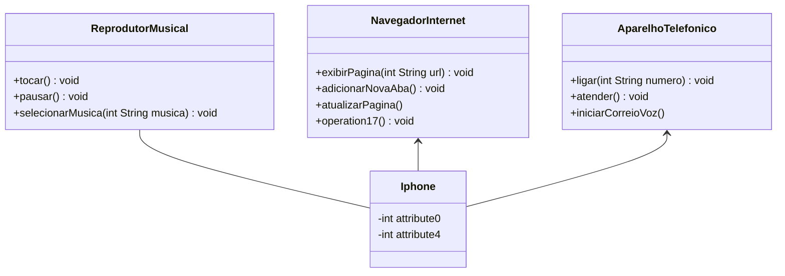

```mermaid
classDiagram
class Iphone {
    -int attribute0
    -int attribute4
}
class ReprodutorMusical {
    +tocar() void
    +pausar() void
    +selecionarMusica(int String musica) void
}
class AparelhoTelefonico {
    +ligar(int String numero) void
    +atender() void
    +iniciarCorreioVoz() 
}
class NavegadorInternet {
    +exibirPagina(int String url) void
    +adicionarNovaAba() void
    +atualizarPagina() 
    +operation17() void
}
ReprodutorMusical -- Iphone
NavegadorInternet <-- Iphone
AparelhoTelefonico <-- Iphone
%%Generated by Astah mermaid plugin
```
